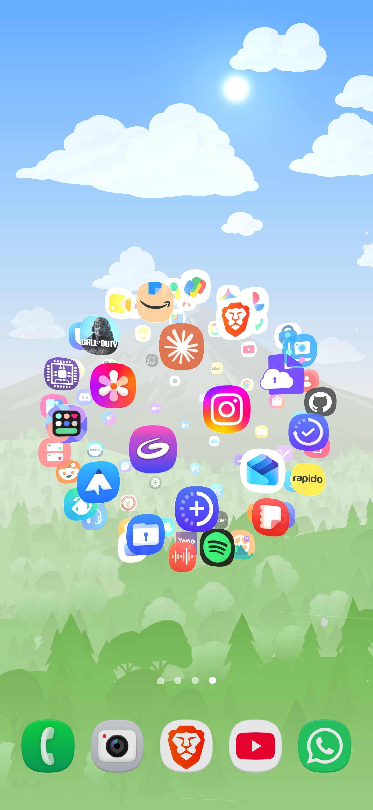

# AuraOrbit 🌍✨

**AuraOrbit** is a next-generation Android Live Wallpaper featuring a fully interactive 3D sphere that orbits your favorite apps right on your home screen. Built on the high-performance libGDX game engine, it leverages a golden angle Fibonacci distribution to plot your apps perfectly in a 3D space, supporting true 120 FPS hardware refresh rates!


[This is video for how to show on mobile](Video/Full%20details.mp4)



## 🚀 Core Features

**3D Sphere**
- Rotate apps with natural quaternion-based momentum at up to 120 FPS (30/60/90/120 selectable)
- Drag-and-drop sphere positioning — center, top, bottom, or anywhere via a custom editor (which also scales the sphere radius!)
- Adjustable icon size and rotation speed

**Background & Blur**
- Upload a custom background image or use the default gradient
- Dual blur system: independent Blur Radius (area) and Blur Strength (intensity) controls
- Five blur presets from "No Blur" to "Full Screen Blur" with real-time preview

**Icon Pack Support**
- Apply third-party icon packs (Nova, Apex, etc.) to all apps orbiting your sphere
- Automatically applies to your group widgets, app picker, and the central AuraOrbit logo

**App Groups**
- Create color-coded groups with 8 presets + custom RGB color picker
- Assign apps to groups; groups appear as 3D translucent backdrops on the sphere
- **Individual Group Overrides**: Configure Sphere Position, Background Image, and Blur explicitly for each group!
- Search and bulk-select apps in the picker with an intuitive Edit Apps popup dialog

**Home Screen Widgets**
- Per-group widgets with live color-coded previews
- Custom logo upload per widget (or use the default planet icon)
- Toggle: transparent background, hide logo, hide text, system Material You color
- Custom orbit/ring color per group
- Pin multiple widgets for different groups simultaneously

**Standalone Sphere Mode**
- Launch AuraOrbit as a fullscreen immersive app from any group widget
- Floats perfectly over your home screen seamlessly with zero black dimming!
- Swipe-from-edge to reveal system bars; screen stays on
- Tap apps to launch; tap outside to return home

**Launcher Integration**
- Optional accessibility service detects which home screen page you're on
- Sphere auto-shows/hides when switching pages or opening the app drawer

**Performance & Privacy**
- Advanced memory caching for instant sphere loads
- Zero unnecessary permissions — FOSS, no tracking

📖 **Want to see everything AuraOrbit can do? Check out the [Comprehensive Features Guide](features.md).**

## 🛠️ Architecture

AuraOrbit seamlessly merges standard Android UI with a high-performance C++ OpenGL backend via libGDX:
- **`MyWallpaperService.java`**: The Android bridge handling the OS lifecycle, 120Hz unlock (`Surface.setFrameRate`), and launcher scroll offsets.
- **`SphereEngine.java`**: The core 3D engine running libGDX (`ApplicationListener`). Uses `DecalBatch` for ultra-fast 3D billboarding and `ModelBatch` for the translucent group backdrops.
- **`LiveWallpaperSettings.java`**: A purely code-driven Settings Activity (using `PreferenceFragmentCompat` and programmatically generated dialogs) to curate your apps and build custom-colored groups.
- **`AppFetcher.java`**: The data pipeline directly interfacing with Android's `PackageManager` to pull high-res application icons and convert them safely into OpenGL textures on the fly.

## 📦 How to Build & Install

**AuraOrbit will be available on the Google Play Store very soon!**

In the meantime, you can download the latest signed APK from the Releases page:
👉 **[Download the latest APK](https://github.com/JaiminPatel345/AuraOrbit/releases/latest)**

If you prefer to build it from source, the codebase requires **Java 17+** (due to AGP 8.x) to build correctly. Newer versions like Java 21 work perfectly as well. 

**Via Android Studio (Recommended)**
1. Open the project folder in Android Studio.
2. Connect your device (ensure USB Debugging is on).
3. Click the green ▶️ **Run** button.

**Via Command Line (Mac/Linux)**
```bash
# Ensure Java 17 is active in your terminal environment
export JAVA_HOME=/path/to/java/17
./gradlew assembleDebug
adb install app/build/outputs/apk/debug/app-debug.apk
```
*Note: If you have a running emulator or connected device, you can use `./gradlew installDebug` to build and deploy in a single step.*

## ⚙️ Configuration

Once installed, navigate to:
**Settings → Wallpaper & style → Change wallpapers → Live wallpapers → AuraOrbit**. 

Hit the **Settings ⚙️** icon in the preview window to open the AuraOrbit dashboard where you can:
- Select which apps appear on your orbit.
- Apply third-party icon packs directly to your 3D sphere.
- Create color-coded app groups with custom names and colors.
- Drag and scale the sphere to any position on your screen.
- Upload a custom background image and tune blur radius + strength.
- Override backgrounds, blur, and positioning for individual app groups!
- Customize each group's widget: logo, ring color, transparency, text visibility.
- Set the target framerate (30/60/90/120 FPS).
- Adjust icon size and rotation speed.

## 🤝 Contributing

We welcome contributions from everyone! If you want to contribute to AuraOrbit, feel free to fork the repository, make your changes, and submit a pull request. 

If you find any bugs or have feature requests, please **raise an issue** on GitHub so we can look into it. 

## 📄 License

This project is licensed under the **GNU General Public License v3.0 (GPLv3)**. It is Free and Open Source Software (FOSS). You are free to use, modify, and distribute the software.

For more details, please read the [LICENSE](LICENSE) file.
